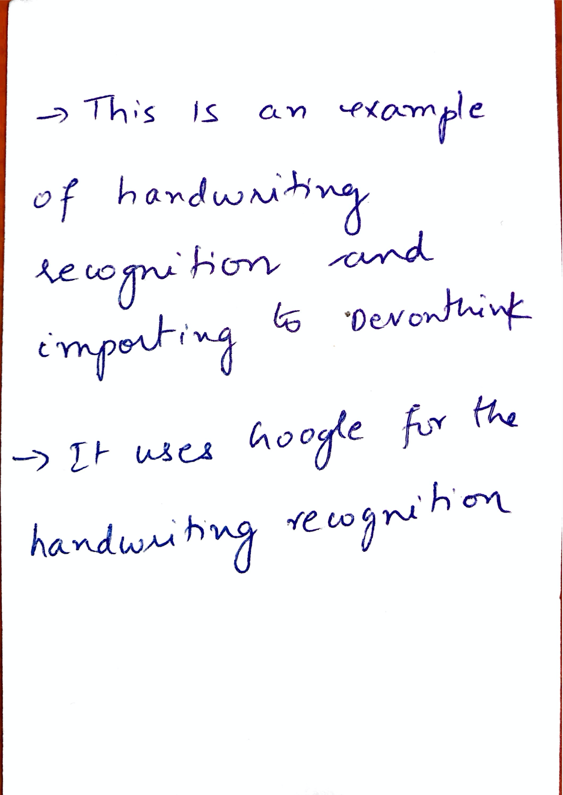

# rocketbook
Use Google Vision API to convert your handwritten note into text and create a merged pdf 

This was tested on Mac OS X

This is inspired by [Rocketbook Reusable Notebook](https://getrocketbook.com/)
the ease with each handwritten notes are converted to pdf and uploaded to a
cloud folder. 

This workflow does not require Rocketbook. You can scan any handwritten notes
using something like [Scanner Pro by Readdle](https://apps.apple.com/us/app/scanner-pro-by-readdle/id333710667) and get a pdf with your handwritten notes turned into text using the Google Vision API.

The set of scripts rely on several applications that are easily available for
the Mac. 

Example usage:

$ ./notes2devonthink.sh sample_note.pdf

will generate a pdf with the handwritten notes converted into text appended to
the pdf. 
A file like this 

will get converted to a file like this

